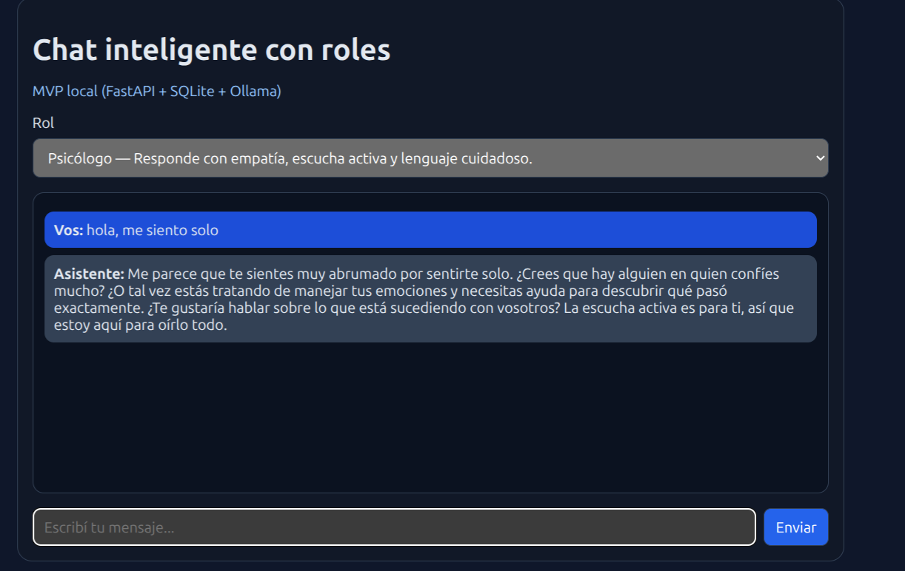
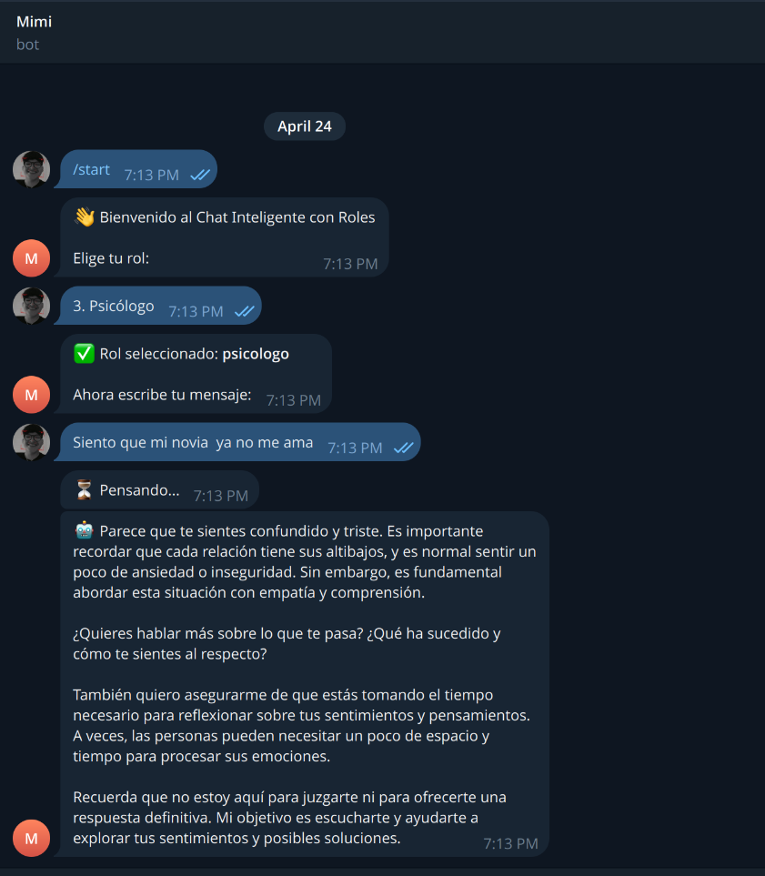

# Chat Inteligente con Roles

**Estudiante:** William Manuel Garcia Gonzalez
**Carné:** 090-22-3022
**Curso:** Inteligencia Artificial

---

## Descripción

Aplicación de chat donde el usuario selecciona un rol antes de hacer una pregunta. Según el rol elegido, el sistema modifica el prompt que se envía al modelo para que la respuesta tenga ese estilo y enfoque.

- **Profesor** → respuestas explicativas, paso a paso, con ejemplos simples
- **Programador** → respuestas técnicas, con buenas prácticas y código
- **Psicólogo** → respuestas empáticas, con escucha activa y lenguaje cuidadoso
- **Negocios** → respuestas enfocadas en estrategia, impacto y decisiones accionables

---

## ¿Qué se construyó?

Este MVP demuestra el uso de IA generativa local con comportamiento agéntico basado en roles. El sistema completo incluye:

- Un **backend en FastAPI** que recibe preguntas, aplica el prompt del rol y consulta al modelo local
- Una **interfaz web** mínima incluida en el mismo backend
- **Persistencia en SQLite** para guardar el historial de conversaciones
- Un **bot de Telegram** que conecta la app al canal de mensajería

---

## Modelo utilizado

**llama3.2:1b** corriendo localmente con [Ollama](https://ollama.com/)

Se eligió este modelo porque es liviano (1.3 GB), corre en CPU sin necesidad de GPU dedicada, y es suficiente para demostrar el comportamiento por roles en un entorno académico con recursos limitados.

```bash
ollama pull llama3.2:1b
```

---

## Stack tecnológico

| Capa            | Tecnología             |
| --------------- | ---------------------- |
| Backend API     | FastAPI                |
| Servidor        | Uvicorn                |
| Base de datos   | SQLite + SQLAlchemy    |
| Modelo LLM      | llama3.2:1b via Ollama |
| Cliente HTTP    | httpx                  |
| Configuración   | pydantic-settings      |
| Bot de Telegram | python-telegram-bot    |
| Frontend        | HTML, CSS, JavaScript  |

---

## Arquitectura

```
Telegram → Bot Python → FastAPI → Ollama (llama3.2:1b)
                            ↕
                         SQLite
```

El flujo de una consulta es:

1. El usuario elige un rol y escribe un mensaje (web o Telegram)
2. El backend arma el prompt con el rol seleccionado
3. Se consulta al modelo local vía Ollama
4. La respuesta se persiste en SQLite y se devuelve al usuario

---

## Dependencias

### Backend (`backend/requirements.txt`)

```
fastapi
uvicorn
httpx
sqlalchemy
pydantic-settings
python-dotenv
pytest
```

### Bot de Telegram (nueva dependencia)

```bash
pip install python-telegram-bot
```

Esta librería permite conectar el backend con Telegram usando la API oficial de bots. El bot maneja la selección de rol, mantiene la sesión del usuario y reenvía las respuestas del modelo.

---

## Configuración

Crear el archivo `backend/.env`:

```bash
cp backend/.env.example backend/.env
```

Variables de entorno:

```dotenv
DATABASE_URL=sqlite:///./chat_roles.db
OLLAMA_BASE_URL=http://localhost:11434
OLLAMA_MODEL=llama3.2:1b
OLLAMA_TIMEOUT_SECONDS=120
```

> ⚠️ El timeout se aumentó a 120 segundos porque el modelo corre en CPU y puede tardar más en la primera respuesta.

---

## Cómo correr el proyecto

### Requisitos previos

- Python 3.11+
- Ollama instalado
- Modelo descargado: `ollama pull llama3.2:1b`

### 1. Instalar dependencias

```bash
python -m venv .venv
source .venv/bin/activate
pip install -r backend/requirements.txt
pip install python-telegram-bot
```

### 2. Levantar el backend (Terminal 1)

```bash
uvicorn app.main:app --reload --app-dir backend
```

Abrir en el navegador: `http://127.0.0.1:8000/`

### 3. Correr el bot de Telegram (Terminal 2)

```bash
python telegram_bot.py
```

---

## Estructura del proyecto

```
.
├── backend/
│   ├── app/
│   │   ├── api/
│   │   ├── application/
│   │   ├── domain/
│   │   │   └── roles.py
│   │   ├── infrastructure/
│   │   │   ├── db/
│   │   │   └── llm/
│   │   ├── static/
│   │   ├── config.py
│   │   └── main.py
│   ├── tests/
│   ├── .env.example
│   └── requirements.txt
├── docs/
│   └── screenshots/
├── telegram_bot.py
├── pytest.ini
└── README.md
```

---

## Capturas

### Interfaz web



### Bot de Telegram



---

## Roles disponibles

| ID            | Label       | Comportamiento                                             |
| ------------- | ----------- | ---------------------------------------------------------- |
| `profesor`    | Profesor    | Explica con claridad, paso a paso y con ejemplos simples   |
| `programador` | Programador | Prioriza precisión técnica, buenas prácticas y código útil |
| `psicologo`   | Psicólogo   | Usa lenguaje empático, cuidadoso y reflexivo               |
| `negocios`    | Negocios    | Se enfoca en estrategia, impacto y decisiones accionables  |

---

## Notas finales

Este proyecto demuestra que con herramientas de código abierto y presupuesto cero es posible construir una aplicación de IA generativa funcional, con comportamiento agéntico basado en roles, persistencia de conversaciones y múltiples canales de acceso.
